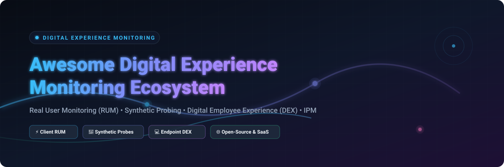

<p align="center">
  <a href="https://github.com/ishandutta2007/Awesome-Digital-Experience-Monitoring">
    
  </a>
</p>

<p align="center">
  <a href="https://github.com/ishandutta2007/Awesome-Awesome-Awesome"></a><a href="https://discord.gg/jc4xtF58Ve"></a>
  <a href="https://github.com/ishandutta2007/Awesome-Awesome-Awesome"></a>
  <a href="LICENSE"></a>
  <a href="https://github.com/ishandutta2007/Awesome-Digital-Experience-Monitoring/stargazers"></a>
  <a href="https://github.com/ishandutta2007"></a>
</p>

> 🌐 A curated list of **Digital Experience Monitoring (DEM)**, **Real User Monitoring (RUM)**, **Digital Employee Experience (DEX)**, **Synthetic Monitoring**, and **Internet Performance Monitoring (IPM)** solutions—featuring commercial enterprise SaaS platforms and leading open-source projects.

---

## 📌 Table of Contents

- 🔍 [Overview & Market Intelligence](#-overview--market-intelligence)
- 📊 [Top SaaS & Commercial DEM Platforms](#-top-saas--commercial-dem-platforms)
- ⚡ [Open-Source GitHub Projects](#-open-source-github-projects)
- 🏛️ [DEM Architectural Pillars](#️-dem-architectural-pillars)
- 💖 [Support & Community](#-support--community)
- 📈 [Star History](#-star-history)
- 🤝 [How to Contribute](#-how-to-contribute)
- 📜 [Disclaimer & License](#-disclaimer--license)

---

## 🔍 Overview & Market Intelligence

**Digital Experience Monitoring (DEM)** measures and optimizes how end-users interact with digital applications, services, and network paths. DEM combines three core telemetry disciplines:
1. ⚡ **Real User Monitoring (RUM)** – Passive client-side performance, Core Web Vitals, and browser session tracking.
2. 🎯 **Synthetic Monitoring** – Scripted proactive probes validating availability, API endpoints, and critical transactional user journeys.
3. 💻 **Endpoint & Network Path Visibility (DEX / IPM)** – Device-level performance monitoring (CPU, RAM, VDI, Wi-Fi) and internet route/BGP path telemetry.

> 📊 **Market Intelligence**: The global Digital Experience Monitoring (DEM) and Digital Employee Experience (DEX) market size is estimated at **$3.5 Billion to $4.8 Billion (2025–2026)**, expanding at a **~16.5% CAGR**. The sector is **moderately fragmented**—led at the top by full-stack observability conglomerates (Datadog, Dynatrace, New Relic) alongside high-growth specialized DEX & network path pioneers (Nexthink, ThousandEyes, Catchpoint, ControlUp).

---

## 📊 Top SaaS & Commercial DEM Platforms

Below is a curated comparison of leading commercial Digital Experience Monitoring and Digital Employee Experience platforms, **sorted by company size, valuation, and revenue (descending)**.

| Platform / Company | Key DEM / DEX Capabilities | Pricing (Starting Tier) | Free Tier / Trial Limits | Company Size / Valuation / Revenue |
| :--- | :--- | :--- | :--- | :--- |
| 🐶 **[Datadog RUM & Synthetics](https://www.datadoghq.com/)** | Full-stack DEM featuring client-side RUM, session replay, Core Web Vitals, and global synthetic probes. | **$0.10 per 1,000 RUM sessions** \| **$5.00 per 10,000 API synthetic runs** ($15.00/host/mo base infrastructure) | **14-day free trial** (unlimited hosts & metrics); Free Forever tier available (up to 5 hosts, 1-day retention, excludes RUM) | **~$83.0 Billion** Market Cap \| **~$4.2 Billion** Annual Revenue |
| 👁️ **[Cisco ThousandEyes](https://www.thousandeyes.com/)** | Internet Performance Monitoring (IPM), synthetic path probing, BGP routing visibility, and endpoint DEX. | **~$0.0005 – $0.002 per transaction unit** (Enterprise contracts start at ~$12,000/year) | **15-day free trial** (full access to Cloud & Enterprise synthetic probes) + 60-day Traffic Insights trial | **~$200.0+ Billion** Parent Market Cap \| **~$1.0 Billion** Acquisition ($100M+ standalone ARR) |
| 🤖 **[Dynatrace DEM](https://www.dynatrace.com/)** | AI-powered DEM suite covering Real User Monitoring, session replay, synthetic checks, and full-stack tracing. | **$0.00225 per RUM session** (**$0.0045/session** with Session Replay) \| Infrastructure from $0.04/host-hour | **15-day free trial** (includes 1,000 DEM unit credits; no credit card required) | **~$16.7 Billion** Market Cap \| **~$2.1 Billion** Annual Recurring Revenue (ARR) |
| 📈 **[New Relic DEM](https://www.newrelic.com/)** | All-in-one DEM platform offering browser RUM, mobile app performance, synthetic checks, and user session diagnostics. | **$0.30 per GB ingest** above free tier + **$49.00/core user/month** (Standard Plan) | **Free Forever plan** (100 GB/month data ingest, 1 full platform user, unlimited basic users) | **~$6.5 Billion** Acquisition Valuation (Francisco Partners & TPG) \| **~$1.0 Billion** Revenue |
| 🚀 **[Nexthink](https://www.nexthink.com/)** | Category leader in Digital Employee Experience (DEX), EUC workspace health, event automation, and device telemetry. | Enterprise DEX licensing starting at **~$6.00 – $10.00 per endpoint/month** (billed annually) | **30-day guided proof-of-concept (POC)** & interactive sandbox trial environment | **~$3.0 Billion** Valuation (Vista Equity Partners) \| **~$310 Million** ARR |
| 🎛️ **[ControlUp](https://www.controlup.com/)** | Real-time Digital Employee Experience (DEX) management, VDI/DaaS optimization, and endpoint monitoring. | DEX Pro tier starting at **~$4.50 – $6.00 per user/endpoint/month** (billed annually) | **21-day free trial** (monitors up to 50 endpoints/VDIs with real-time metrics and DEX scoring) | **~$1.0 Billion+** Unicorn Valuation \| **~$100 Million+** ARR |
| 🌊 **[Aternity (Riverbed)](https://www.riverbed.com/products/aternity)** | Enterprise DEX platform tracking click-to-render application speed, device health, and EUC user satisfaction scores. | Enterprise agent tier starting at **~$5.00 – $8.00 per endpoint/month** (billed annually) | **30-day free trial** (covers up to 50 physical or virtual endpoints with complete DEX telemetry) | **~$1.0 Billion** Parent Revenue \| **~$100 Million** Aternity Unit ARR |
| 🎯 **[Catchpoint](https://www.catchpoint.com/)** | Internet Performance Monitoring (IPM) & DEM platform with global synthetic testing and BGP route intelligence. | Synthetic node monitoring starting at **~$150.00/month per synthetic monitor node** (annual contract basis) | **14-day interactive trial** (includes up to 100 synthetic test runs across 250+ global nodes) | **>$250 Million** Acquisition (LogicMonitor) \| **~$50 Million** ARR |
| 💻 **[Lakeside Software (SysTrack)](https://www.lakesidesoftware.com/)** | Workspace telemetry, IT asset optimization, and digital employee experience governance platform. | SysTrack Cloud starting at **~$4.00 – $7.00 per workspace endpoint/month** (billed annually) | **14-day enterprise proof-of-concept (POC)** trial (supports up to 25 endpoints with EUC analytics) | **~$200 Million – $300 Million** Est. Valuation (Insight Partners backed) \| **~$60 Million** ARR |
| ⚙️ **[eG Innovations](https://www.eginnovations.com/)** | End-to-end user experience and infrastructure monitoring for VDI, digital workspaces, and enterprise SaaS apps. | **$100.00/month** (Self-Hosted Subscription) or **$125.00/month** (SaaS Cloud Subscription) | **30-day free trial** (full SaaS access for up to 5 servers/hypervisors or 20 virtual desktops) | **~$50 Million – $100 Million** Est. Valuation \| **~$25 Million – $50 Million** ARR |

---

## ⚡ Open-Source GitHub Projects

The open-source ecosystem offers powerful modular building blocks for RUM, synthetic probes, session replay, and endpoint DEX instrumentation. Below are top open-source projects, **sorted by GitHub star count (descending)**.

1. 🐻 **[louislam/uptime-kuma](https://github.com/louislam/uptime-kuma)** [](https://github.com/louislam/uptime-kuma/stargazers)  
   Self-hosted synthetic uptime & status monitoring tool supporting HTTP/S, TCP, Ping, DNS, and multi-channel incident notifications.

2. 📈 **[netdata/netdata](https://github.com/netdata/netdata)** [](https://github.com/netdata/netdata/stargazers)  
   Real-time endpoint and infrastructure performance monitoring tool providing per-second metrics for hardware and operating systems.

3. 🦔 **[posthog/posthog](https://github.com/posthog/posthog)** [](https://github.com/posthog/posthog/stargazers)  
   Open-source product analytics suite with session replay, DOM recording, Web Vitals RUM, and feature flagging.

4. 📊 **[signoz/signoz](https://github.com/signoz/signoz)** [](https://github.com/signoz/signoz/stargazers)  
   OpenTelemetry-native APM and observability platform offering built-in browser RUM tracing, log management, and metrics.

5. 🚀 **[grafana/k6](https://github.com/grafana/k6)** [](https://github.com/grafana/k6/stargazers)  
   Developer-centric, scriptable synthetic monitoring, browser automation, and load testing tool built in Go & JavaScript.

6. 🛡️ **[osquery/osquery](https://github.com/osquery/osquery)** [](https://github.com/osquery/osquery/stargazers)  
   SQL-based operating system instrumentation framework for gathering custom Digital Employee Experience (DEX) endpoint metrics.

7. 📼 **[openreplay/openreplay](https://github.com/openreplay/openreplay)** [](https://github.com/openreplay/openreplay/stargazers)  
   Self-hosted session replay, network payload inspection, and front-end performance debugging suite for web applications.

8. ⚡ **[hyperdxio/hyperdx](https://github.com/hyperdxio/hyperdx)** [](https://github.com/hyperdxio/hyperdx/stargazers)  
   Open-source observability platform linking frontend browser RUM sessions with backend microservice traces and logs.

9. 💡 **[highlight/highlight](https://github.com/highlight/highlight)** [](https://github.com/highlight/highlight/stargazers)  
   Full-stack web application monitoring platform providing session replay, client error tracking, and web vitals monitoring.

10. 📦 **[prometheus/blackbox_exporter](https://github.com/prometheus/blackbox_exporter)** [](https://github.com/prometheus/blackbox_exporter/stargazers)  
    Prometheus blackbox probing exporter for synthetic checks over HTTP, HTTPS, DNS, TCP, and ICMP endpoints.

11. 🐿️ **[uptrace/uptrace](https://github.com/uptrace/uptrace)** [](https://github.com/uptrace/uptrace/stargazers)  
    OpenTelemetry APM and RUM tracing system powered by ClickHouse for high-throughput distributed tracing.

12. 🌐 **[open-telemetry/opentelemetry-js](https://github.com/open-telemetry/opentelemetry-js)** [](https://github.com/open-telemetry/opentelemetry-js/stargazers)  
    Vendor-neutral OpenTelemetry JavaScript SDK for browser and Node.js client-side RUM performance instrumentation.

13. 🤖 **[Checkmk/checkmk](https://github.com/Checkmk/checkmk)** [](https://github.com/Checkmk/checkmk/stargazers)  
    Comprehensive IT infrastructure and application monitoring platform extensible with synthetic user experience plugins.

14. 🔥 **[grafana/faro-web-sdk](https://github.com/grafana/faro-web-sdk)** [](https://github.com/grafana/faro-web-sdk/stargazers)  
    Open-source Web SDK for Real User Monitoring—capturing frontend logs, errors, traces, and Web Vitals into Grafana.

15. 🔎 **[elastic/apm-agent-rum-js](https://github.com/elastic/apm-agent-rum-js)** [](https://github.com/elastic/apm-agent-rum-js/stargazers)  
    Official Elastic RUM JavaScript Agent for real user browser monitoring integrated with Elastic APM and Kibana.

16. ⚙️ **[grafana/synthetic-monitoring-agent](https://github.com/grafana/synthetic-monitoring-agent)** [](https://github.com/grafana/synthetic-monitoring-agent/stargazers)  
    Synthetic monitoring agent used by Grafana Cloud and self-hosted Grafana installations for continuous probe execution.

---

## 🏛️ DEM Architectural Pillars

```
+-----------------------------------------------------------------------------------+
|                        Digital Experience Monitoring (DEM)                        |
+--------------------------+--------------------------+-----------------------------+
|    Real User Monitoring  |   Synthetic Monitoring   | Endpoint & Network (DEX/IPM)|
|          (RUM)           |       (Proactive)        |         (Telemetry)         |
+--------------------------+--------------------------+-----------------------------+
| • Page Load Time & TTFB  | • Scripted User Paths    | • Wi-Fi & Network Latency   |
| • Core Web Vitals (LCP)  | • API & HTTP Probes      | • Endpoint CPU, RAM, Disk   |
| • JS Error Tracking      | • Multi-region Availability| • BGP Routing & Path Loss   |
| • Session Replay & DOM   | • SLA/SLO Validation     | • VDI / DaaS Session Health |
+--------------------------+--------------------------+-----------------------------+
```

---

## 💖 Support & Community

Thank you for visiting and supporting the **Awesome Digital Experience Monitoring** project! 🚀

If you find this repository helpful for your SRE, DEX, or observability workflow, please consider supporting it:
- ⭐ **Star** this repository to help others discover it!
- 🍴 **Fork** it to contribute your own tools, SaaS platforms, or open-source additions.
- 📢 **Share** it with your workplace, DevOps, and digital experience engineering teams.

<p align="left">
  <a href="https://github.com/sponsors/ishandutta2007"></a>
  <a href="https://github.com/sponsors/ishandutta2007"></a>
</p>

---

## 📈 Star History

[](https://star-history.dera.page/#ishandutta2007/Awesome-Digital-Experience-Monitoring&type=date&legend=top-left)

---

## 🤝 How to Contribute

Contributions are highly welcome! To add a new SaaS platform or Open-Source DEM tool:

1. **Fork** the repository.
2. Add your entry under the appropriate section following the existing formatting guidelines:
   - For **SaaS**: Include accurate starting price, free trial/tier limits, description, and company size/valuation.
   - For **Open-Source**: Include repository link, GitHub star badge (`style=social&color=white`) linking to the stargazers page, and description.
3. Submit a **Pull Request** with a brief summary of the added tool.

---

## 📜 Disclaimer & License

- **Disclaimer**: This is a community-curated collection intended for educational and evaluation purposes. Financial estimates, star counts, and pricing tiers reflect published market data as of **October 2026** and are subject to vendor updates.
- **License**: Released under the [Creative Commons Zero v1.0 Universal (CC0 1.0)](LICENSE) Public Domain Dedication.
